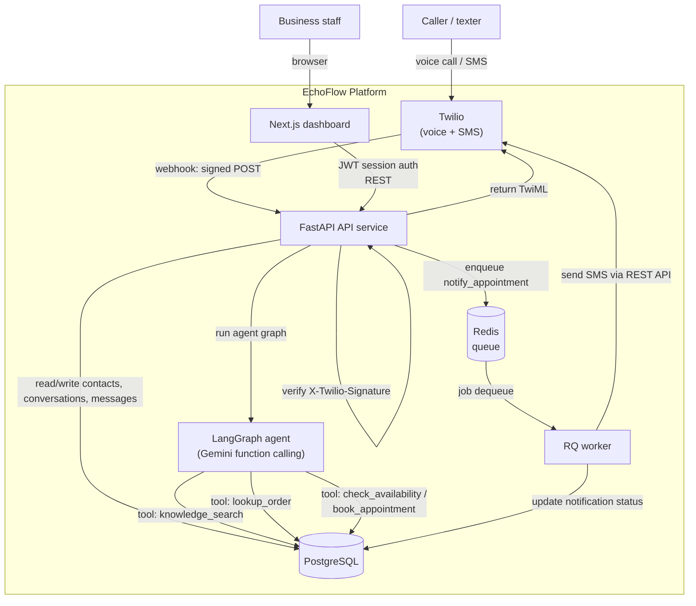
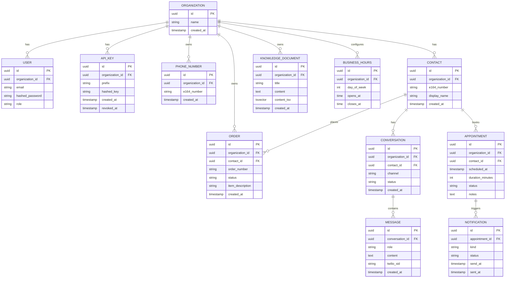

# Architecture: EchoFlow

## System diagram

## Component responsibilities

| Component | Responsibility |
|---|---|
| API service | Twilio webhook handlers (signature verification, TwiML generation), dashboard auth, agent orchestration (LangGraph), knowledge base/appointment/order CRUD, analytics aggregation, OpenAPI docs |
| Worker | Async outbound notifications: appointment confirmation and reminder SMS sent via the Twilio REST API |
| Web dashboard | Conversation log viewer, appointment calendar, knowledge base management, analytics overview |
| PostgreSQL | System of record for all entities, plus full-text search index over knowledge documents (the agent's `knowledge_search` tool) |
| Redis | Job queue between API and worker for outbound notifications |
| Twilio (external) | Inbound call/SMS routing to EchoFlow's webhooks, speech-to-text and text-to-speech for voice (via `<Gather input="speech">` / `<Say>`), outbound SMS delivery |
| Gemini (external) | Function-calling model driving the agent's tool selection and natural-language responses |

## Entity relationship (core tables)

## Request flow: inbound voice call

1. Twilio receives a call to a configured number and POSTs to `/v1/webhooks/voice/incoming`.
2. API verifies `X-Twilio-Signature`, resolves the `Organization` by the `To` number, finds-or-creates a `Contact` by the `From` number, creates a `Conversation` (`channel=voice`).
3. API returns TwiML: a greeting plus `<Gather input="speech" action="/v1/webhooks/voice/respond">`.
4. Twilio transcribes the caller's speech and POSTs the transcript to `/v1/webhooks/voice/respond`.
5. API persists the caller's turn as a `Message`, runs the LangGraph agent graph (tool calls as needed against the DB), persists the agent's reply as a `Message`, and returns TwiML: `<Say>` the reply, then either another `<Gather>` (conversation continues) or `<Hangup>` (agent determined the request is resolved).

## Request flow: inbound SMS

1. Twilio receives a text to a configured number and POSTs to `/v1/webhooks/sms/incoming`.
2. API verifies the signature, resolves `Organization`/`Contact` the same way as voice, finds-or-creates a `Conversation` (`channel=sms`, reused if one is already open for this contact).
3. API persists the inbound `Message`, runs the same agent graph, persists the reply.
4. API returns TwiML `<Message>` with the reply text.

## Request flow: booking an appointment

1. During either a voice or SMS conversation, the agent calls the `check_availability` tool (queries `BUSINESS_HOURS` and existing `APPOINTMENT` rows for open slots).
2. Once the caller confirms a slot, the agent calls `book_appointment`, which creates an `APPOINTMENT` row and enqueues a `notify_appointment` job (kind=`confirmation`) onto Redis.
3. The RQ worker picks up the job, sends a confirmation SMS via the Twilio REST API, and writes a `NOTIFICATION` row.
4. A scheduled sweep (documented in [ROADMAP.md](ROADMAP.md)) enqueues a `notify_appointment` job (kind=`reminder`) ahead of `scheduled_at`.

## Deployment topology (v1)

Single-host Docker Compose: `api`, `worker`, `web`, `postgres`, `redis` containers on one Docker network, `web` and `api` exposed to the host (and `api` additionally reachable by Twilio's webhooks, which requires a public URL — see the deployment guide once the scaffolding PR lands). `TWILIO_ACCOUNT_SID`, `TWILIO_AUTH_TOKEN`, `TWILIO_PHONE_NUMBER`, and `GEMINI_API_KEY` are the required external secrets.
